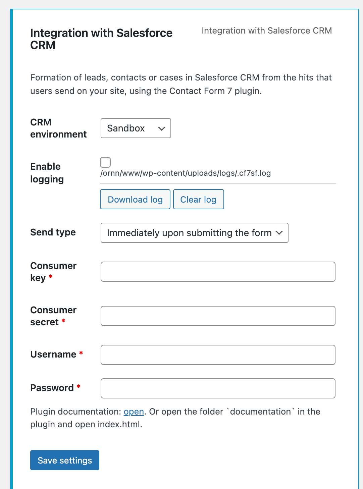

# Contact Form 7와 세일즈포스를 연결하여 보자

## 1. 세일즈포스 플러그인 구매  
- 조건 1. 기존에 사용하던 "파이프드라이브"와 최대한 유사한 설정 방법 제공해야한다.  
- 조건 2. 유지관리 교육에 대한 리스크 최소한다.  

> <결론>  
> - 기존 "파이프드라이브" 연결 플러그인과 동일한 개발사의 제품을 이용하여 관리 교육에 대한 리스크를 최소화한다.  
>   
> - [플러그인 구매 링크 바로가기](https://codecanyon.net/item/contact-form-7-salesforce-crm-integration/20922509?_ga=2.116426694.1947710451.1642470220-1364696538.1641536680)
  
---  
  
## 2. 세일즈포스 플러그인 설치 순서
1. 플러그인 압축파일 다운로드  
2. 플러그인 라이센스 pdf 다운로드  
3. 워드프레스 플러그인 설치  
4. 관리자 화면 위치 : 연락처 → 통합 → Integration with Salesforce CRM  
5. 라이센스 등록 및 **Verify** 클릭
> * 플러그인 삭제 시 꼭 **Unverify**를 통해 라이센스 사용을 취소하여야 재사용이 가능합니다.  
> * 혹시 등록 취소를 하지 않고 삭제하셨다면 플러그인 문의 게시판으로 문의하시면 됩니다. (영어) 
  
---  
  
## 3. 세일즈포스 연결  
1). 세일즈포스 관리자 설정  
- [플러그인에서 제공하는 설정 방법 바로가기](https://itgalaxy.company/en/create-connected-app-in-salesforce-crm/)  
  
> 주의)  
"Callback URL" 설정 시 세일즈포스 담당자 또는 개발사에 문의하여 테스트 및 라이브 상황에 맞춰 설정해야합니다.    
  
2). 플러그인 설정  
</img>

- CRM environment  
  - Production : 운영버전 연결 시 사용  
  - Sandbox : 개발버전 연결 시 사용  

- Enable logging
  - 사용 현황에 대해 기록한다.  

- Send Type  
  - (O) Immediately upon submitting the form : 양식을 제출하는 즉시
  - Action Scheduler : 작업 스케줄러통해 약간의 지연 제출  
  
- Consumer Key : 세일즈포스 관리자 설정 시 발급된 키값 입력
- Consumer secret :  세일즈포스 관리자 설정 시 발급된 번호 입력
- Username / Password : 세일즈포스 관리자에게 문의하여 접속 계정을 받는다.
---
  
## 3. 연결 후 발생할 수 있는 문제에 대한 해결  
1. 관리자 화면에서 원하는 리코드(파이프라인)에 리드 할당하기  
- 설정 후 테스트를 진행하면 임의의 리코드가 생성되어 접수되는 상황을 맞이하게 될 것입니다.  
- 플러그인 자체 설정에서 리코드 채널(파이프라인)을 지정할 수 없습니다.  
- 따라서 이 부분은 세일즈포스 관리자에게 문의하여 별도의 리코드 설정 필드를 생성하고, 그곳을 통해 연결하여야 합니다.  

---

> 여기까지 진행하시면 홈페이지 관리자로서 모든 일이 마무리 되었습니다.  
이후 부터는 서비스 관리자로서 필드설정, 담당자 배치 등 작업을 진행하면 됩니다.